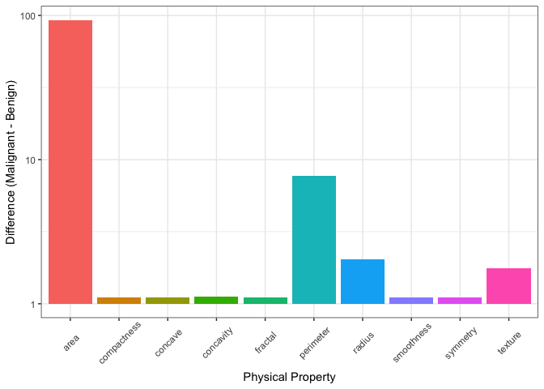
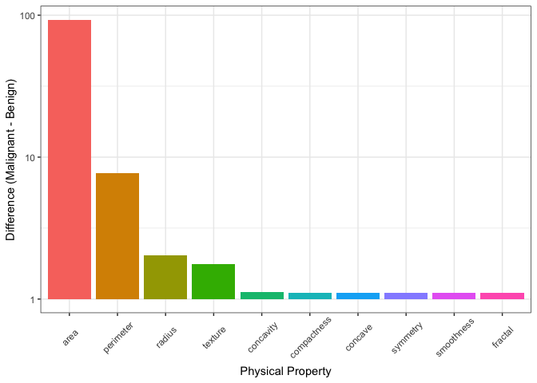
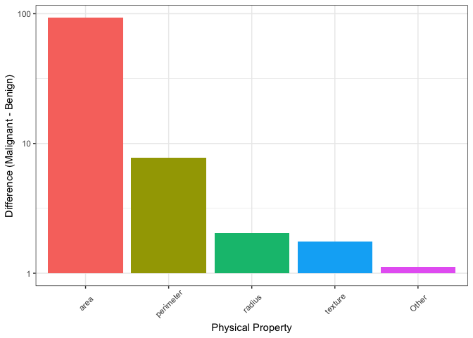

Mini Data Analysis Milestone 2
================

*To complete this milestone, you can edit [this `.rmd`
file](https://raw.githubusercontent.com/UBC-STAT/stat545.stat.ubc.ca/master/content/mini-project/mini-project-2.Rmd)
directly. Fill in the sections that are commented out with
`<!--- start your work here--->`. When you are done, make sure to knit
to an `.md` file by changing the output in the YAML header to
`github_document`, before submitting a tagged release on canvas.*

# Welcome to your second (and last) milestone in your mini data analysis project!

In Milestone 1, you explored your data, came up with research questions,
and obtained some results by making summary tables and graphs. This
time, we will first explore more in depth the concept of *tidy data.*
Then, you’ll be sharpening some of the results you obtained from your
previous milestone by:

-   Manipulating special data types in R: factors and/or dates and
    times.
-   Fitting a model object to your data, and extract a result.
-   Reading and writing data as separate files.

**NOTE**: The main purpose of the mini data analysis is to integrate
what you learn in class in an analysis. Although each milestone provides
a framework for you to conduct your analysis, it’s possible that you
might find the instructions too rigid for your data set. If this is the
case, you may deviate from the instructions – just make sure you’re
demonstrating a wide range of tools and techniques taught in this class.

# Instructions

**To complete this milestone**, edit [this very `.Rmd`
file](https://raw.githubusercontent.com/UBC-STAT/stat545.stat.ubc.ca/master/content/mini-project/mini-project-2.Rmd)
directly. Fill in the sections that are tagged with
`<!--- start your work here--->`.

**To submit this milestone**, make sure to knit this `.Rmd` file to an
`.md` file by changing the YAML output settings from
`output: html_document` to `output: github_document`. Commit and push
all of your work to your mini-analysis GitHub repository, and tag a
release on GitHub. Then, submit a link to your tagged release on canvas.

**Points**: This milestone is worth 55 points (compared to the 45 points
of the Milestone 1): 45 for your analysis, and 10 for your entire
mini-analysis GitHub repository. Details follow.

**Research Questions**: In Milestone 1, you chose two research questions
to focus on. Wherever realistic, your work in this milestone should
relate to these research questions whenever we ask for justification
behind your work. In the case that some tasks in this milestone don’t
align well with one of your research questions, feel free to discuss
your results in the context of a different research question.

# Learning Objectives

By the end of this milestone, you should:

-   Understand what *tidy* data is, and how to create it using `tidyr`.
-   Generate a reproducible and clear report using R Markdown.
-   Manipulating special data types in R: factors and/or dates and
    times.
-   Fitting a model object to your data, and extract a result.
-   Reading and writing data as separate files.

# Setup

Begin by loading your data and the tidyverse package below:

``` r
library(datateachr) # <- might contain the data you picked!
library(tidyverse)
library(broom)
library(here)
```

# Task 1: Tidy your data (15 points)

In this task, we will do several exercises to reshape our data. The goal
here is to understand how to do this reshaping with the `tidyr` package.

A reminder of the definition of *tidy* data:

-   Each row is an **observation**
-   Each column is a **variable**
-   Each cell is a **value**

*Tidy’ing* data is sometimes necessary because it can simplify
computation. Other times it can be nice to organize data so that it can
be easier to understand when read manually.

### 2.1 (2.5 points)

Based on the definition above, can you identify if your data is tidy or
untidy? Go through all your columns, or if you have \>8 variables, just
pick 8, and explain whether the data is untidy or tidy.

<!--------------------------- Start your work below --------------------------->

#### Check if our data is tidy

``` r
# In Milestone 1, I used the cancer_sample dataset
# Check first 8 columns of cancer_sample to check if the data is tidy
cancer_sample %>% 
  select(1:8)
```

    ## # A tibble: 569 × 8
    ##          ID diagnosis radius_mean texture_mean perimet…¹ area_…² smoot…³ compa…⁴
    ##       <dbl> <chr>           <dbl>        <dbl>     <dbl>   <dbl>   <dbl>   <dbl>
    ##  1   842302 M                18.0         10.4     123.    1001   0.118   0.278 
    ##  2   842517 M                20.6         17.8     133.    1326   0.0847  0.0786
    ##  3 84300903 M                19.7         21.2     130     1203   0.110   0.160 
    ##  4 84348301 M                11.4         20.4      77.6    386.  0.142   0.284 
    ##  5 84358402 M                20.3         14.3     135.    1297   0.100   0.133 
    ##  6   843786 M                12.4         15.7      82.6    477.  0.128   0.17  
    ##  7   844359 M                18.2         20.0     120.    1040   0.0946  0.109 
    ##  8 84458202 M                13.7         20.8      90.2    578.  0.119   0.164 
    ##  9   844981 M                13           21.8      87.5    520.  0.127   0.193 
    ## 10 84501001 M                12.5         24.0      84.0    476.  0.119   0.240 
    ## # … with 559 more rows, and abbreviated variable names ¹​perimeter_mean,
    ## #   ²​area_mean, ³​smoothness_mean, ⁴​compactness_mean

The first 8 columns of `cancer_sample` are tidy data. Each column is a
different variable such as ID, diagnosis, or radius_mean, each row is a
different observation or measurement, and each cell contains a value.

<!----------------------------------------------------------------------------->

### 2.2 (5 points)

Now, if your data is tidy, untidy it! Then, tidy it back to it’s
original state.

If your data is untidy, then tidy it! Then, untidy it back to it’s
original state.

Be sure to explain your reasoning for this task. Show us the “before”
and “after”.

<!--------------------------- Start your work below --------------------------->

#### Untidying our data

Since our data is already tidy, we will start by untidying it! To do
this, we will bring the names of each physical parameter being measured
into a single column called `parameters` and all their associated
measurements into a column called `measurements`. We will use
`pivot_longer()` to do this.

``` r
# First save "cancer_sample" into a new object called "cancer"
cancer <- cancer_sample

# Make the data untidy using pivot_longer()
cancer_untidy <- cancer %>% 
  pivot_longer(cols = 3:ncol(.), names_to = "parameters", values_to = "measurements")

glimpse(cancer_untidy)
```

    ## Rows: 17,070
    ## Columns: 4
    ## $ ID           <dbl> 842302, 842302, 842302, 842302, 842302, 842302, 842302, 8…
    ## $ diagnosis    <chr> "M", "M", "M", "M", "M", "M", "M", "M", "M", "M", "M", "M…
    ## $ parameters   <chr> "radius_mean", "texture_mean", "perimeter_mean", "area_me…
    ## $ measurements <dbl> 1.799e+01, 1.038e+01, 1.228e+02, 1.001e+03, 1.184e-01, 2.…

Now we have very untidy data. `parameters` now consists of repeated
variables and each row is no longer a new observation, since they are
repeated for each ID. In this specific case, there isn’t a great reason
to untidy our data; however, untidying it in the way we just did could
be useful for plotting each physical parameter as a discrete variable
for something like a barplot!

Anyway, our data is now untidy and could be useful for future plotting.
Let’s tidy it back up since it will be easier to read and manipulate
using `tidyverse` functions, especially since we are going to do some
wrangling up ahead! To tidy up, we’ll use the “inverse” of
`pivot_longer()`, `pivot_wider()`.

``` r
# Now let's tidy up our data again. We will use pivot_wider() to undo what we did with pivot_longer().
cancer_tidy <- cancer_untidy %>% 
  pivot_wider(names_from = parameters, values_from = measurements)

head(cancer_tidy)
```

    ## # A tibble: 6 × 32
    ##       ID diagn…¹ radiu…² textu…³ perim…⁴ area_…⁵ smoot…⁶ compa…⁷ conca…⁸ conca…⁹
    ##    <dbl> <chr>     <dbl>   <dbl>   <dbl>   <dbl>   <dbl>   <dbl>   <dbl>   <dbl>
    ## 1 8.42e5 M          18.0    10.4   123.    1001   0.118   0.278   0.300   0.147 
    ## 2 8.43e5 M          20.6    17.8   133.    1326   0.0847  0.0786  0.0869  0.0702
    ## 3 8.43e7 M          19.7    21.2   130     1203   0.110   0.160   0.197   0.128 
    ## 4 8.43e7 M          11.4    20.4    77.6    386.  0.142   0.284   0.241   0.105 
    ## 5 8.44e7 M          20.3    14.3   135.    1297   0.100   0.133   0.198   0.104 
    ## 6 8.44e5 M          12.4    15.7    82.6    477.  0.128   0.17    0.158   0.0809
    ## # … with 22 more variables: symmetry_mean <dbl>, fractal_dimension_mean <dbl>,
    ## #   radius_se <dbl>, texture_se <dbl>, perimeter_se <dbl>, area_se <dbl>,
    ## #   smoothness_se <dbl>, compactness_se <dbl>, concavity_se <dbl>,
    ## #   concave_points_se <dbl>, symmetry_se <dbl>, fractal_dimension_se <dbl>,
    ## #   radius_worst <dbl>, texture_worst <dbl>, perimeter_worst <dbl>,
    ## #   area_worst <dbl>, smoothness_worst <dbl>, compactness_worst <dbl>,
    ## #   concavity_worst <dbl>, concave_points_worst <dbl>, symmetry_worst <dbl>, …

Great, now our data is back to the tidyness that it was before. Each
column is once again a variable, in this case a physical parameter, and
each row is a unique observation.

<!----------------------------------------------------------------------------->

### 2.3 (7.5 points)

Now, you should be more familiar with your data, and also have made
progress in answering your research questions. Based on your interest,
and your analyses, pick 2 of the 4 research questions to continue your
analysis in the next four tasks:

<!-------------------------- Start your work below ---------------------------->

1.  *How do physical characteristics of tumours affect malignant
    diagnosis likelihood?*
2.  *How do size parameters affect other parameters of a tumour?*

<!----------------------------------------------------------------------------->

Explain your decision for choosing the above two research questions.

<!--------------------------- Start your work below --------------------------->

**Research Question 1 is an interesting exploratory question that could
help to identify certain physical characteristics as potential
diagnostic markers of tumour malignancy.**

**Research question 2 would be interesting to explore because there are
many physical parameters that are linked in tumours. It would be
valuable to understand how these characteristics are linked and could be
useful to generate models of physical tumour characteristics down the
line.**

<!----------------------------------------------------------------------------->

Now, try to choose a version of your data that you think will be
appropriate to answer these 2 questions. Use between 4 and 8 functions
that we’ve covered so far (i.e. by filtering, cleaning, tidy’ing,
dropping irrelevant columns, etc.).

<!--------------------------- Start your work below --------------------------->

#### Wrangling our data

We will go ahead and modify the original `cancer` dataframe so that it
is more concise and interpretable for us. We are mostly interested in
the “mean” values so let’s not concern ourselves with anything else. In
other words, we will drop all *standard error* and *worst* columns.
Additionally, something that we might really be interested in with
respect to diagnostic markers is the `area_mean`, so let’s arrange
`area_mean` in descending order and also make sure there are no `NA`
values in this column to make the data easier to read and manipulate
moving forward. Finally, let’s replace “M” and “B” in the `diagnosis`
column with the whole words. This is a matter of personal preference,
but will also make the plot labels nicer to read down the line.

``` r
# Summarize our data as above
cancer_dat <- cancer %>% 
  select(-ends_with("worst"), -ends_with("_se")) %>% # 1
  arrange(desc(area_mean)) %>% # 2
  filter(is.na(area_mean) == FALSE) %>% # 3
  summarize(ID, 
            diagnosis = case_when(diagnosis == "M" ~ "Malignant", diagnosis == "B" ~ "Benign"), 
            across(ends_with("mean"))) # 4

glimpse(cancer_dat)
```

    ## Rows: 569
    ## Columns: 12
    ## $ ID                     <dbl> 911296202, 8810703, 873592, 899987, 8611555, 91…
    ## $ diagnosis              <chr> "Malignant", "Malignant", "Malignant", "Maligna…
    ## $ radius_mean            <dbl> 27.42, 28.11, 27.22, 25.73, 25.22, 24.63, 24.25…
    ## $ texture_mean           <dbl> 26.27, 18.47, 21.87, 17.46, 24.91, 21.60, 20.20…
    ## $ perimeter_mean         <dbl> 186.9, 188.5, 182.1, 174.2, 171.5, 165.5, 166.2…
    ## $ area_mean              <dbl> 2501, 2499, 2250, 2010, 1878, 1841, 1761, 1747,…
    ## $ smoothness_mean        <dbl> 0.10840, 0.11420, 0.10940, 0.11490, 0.10630, 0.…
    ## $ compactness_mean       <dbl> 0.19880, 0.15160, 0.19140, 0.23630, 0.26650, 0.…
    ## $ concavity_mean         <dbl> 0.3635, 0.3201, 0.2871, 0.3368, 0.3339, 0.2310,…
    ## $ concave_points_mean    <dbl> 0.16890, 0.15950, 0.18780, 0.19130, 0.18450, 0.…
    ## $ symmetry_mean          <dbl> 0.2061, 0.1648, 0.1800, 0.1956, 0.1829, 0.1991,…
    ## $ fractal_dimension_mean <dbl> 0.05623, 0.05525, 0.05770, 0.06121, 0.06782, 0.…

<!----------------------------------------------------------------------------->

# Task 2: Special Data Types (10)

For this exercise, you’ll be choosing two of the three tasks below –
both tasks that you choose are worth 5 points each.

But first, tasks 1 and 2 below ask you to modify a plot you made in a
previous milestone. The plot you choose should involve plotting across
at least three groups (whether by facetting, or using an aesthetic like
colour). Place this plot below (you’re allowed to modify the plot if
you’d like). If you don’t have such a plot, you’ll need to make one.
Place the code for your plot below.

<!-------------------------- Start your work below ---------------------------->

#### Generate our plot from Milestone 1

Now we can modify our newly made dataframe from above. We will make a
plot that is similar but slightly modified from some of the plots in
Milestone 1.

More specifically, we would like to create a barplot of the *difference*
between means of malignant and benign diagnosis groups. Plotting this
way rather than plotting both of the means *might* be more clear, but I
guess this is a matter up for debate.

First and foremost, let’s create a new dataframe that contains the means
for each diagnosis group. Then we will create another modified dataframe
that contains the malignant means minus benign means.

``` r
# Create a new dataframe containing summary statistics of all physical properties
mean_cancer <- cancer_dat %>% 
  group_by(diagnosis) %>% 
  summarize(across(ends_with("mean"), mean)) 

# Next, create another dataframe that contains the differences between means of diagnosis groups.
sum_cancer <- mean_cancer %>% 
  select(-diagnosis) %>% 
  summarize(across(ends_with("mean"), ~lead(.x) - .x, .names = "{.col}_diff"))%>% 
  na.omit()

glimpse(sum_cancer)
```

    ## Rows: 1
    ## Columns: 10
    ## $ radius_mean_diff            <dbl> 5.316306
    ## $ texture_mean_diff           <dbl> 3.690144
    ## $ perimeter_mean_diff         <dbl> 37.28997
    ## $ area_mean_diff              <dbl> 515.5862
    ## $ smoothness_mean_diff        <dbl> 0.01042084
    ## $ compactness_mean_diff       <dbl> 0.06510316
    ## $ concavity_mean_diff         <dbl> 0.1147171
    ## $ concave_points_mean_diff    <dbl> 0.06227259
    ## $ symmetry_mean_diff          <dbl> 0.01872297
    ## $ fractal_dimension_mean_diff <dbl> -0.0001873006

One important consideration about comparing these *differences* is that
not all differences are the same (?). For example, `area` values are
much larger than any other physical parameter in this dataset.
Differences in area mean might seem huge in comparison to a parameter
like `fractal_complexity`, whose values are about 100X smaller. To
account for this, we can try and normalize all the differences by a
normalization factor, which in this case will be the sum of all the
differences. We will also divide the normalization factor by an
arbitrary number (100) so that trends are a little bit more noticeable
(which I think we are allowed to do?).

``` r
# Create our normalization factor which is the sum of all the mean differences (in our case this is the sum of all columns in our row) divided by 100
normalizationFactor <- rowSums(sum_cancer[1, ]) / 100

# Use pivot_longer() to pivot all physical property names into one column and values into another
# Here, we will also mutate all of our differences by the normalization factor and add an arbitrary constant, 1.1, so that all of our values are greater than 0  (this is important since we will log transform our axis later on and don't want to see negative values when taking log(x < 1))
norm_cancer <- sum_cancer %>% 
  pivot_longer(cols = ends_with("diff"), names_to = "Physical_Property", values_to = "Difference") %>% 
  separate(Physical_Property, into = c("Physical_Property"), sep = "_", remove = TRUE) %>% 
  mutate(Difference = (Difference / normalizationFactor) + 1.1) # normalize our difference values and add arbitrary constant 1.1
```

    ## Warning: Expected 1 pieces. Additional pieces discarded in 10 rows [1, 2, 3, 4,
    ## 5, 6, 7, 8, 9, 10].

``` r
glimpse(norm_cancer)
```

    ## Rows: 10
    ## Columns: 2
    ## $ Physical_Property <chr> "radius", "texture", "perimeter", "area", "smoothnes…
    ## $ Difference        <dbl> 2.045703, 1.756430, 7.733412, 92.816239, 1.101854, 1…

Now let’s generate our barplot:

``` r
# Plot our means between Groups using geom_point()
norm_cancer %>% 
  ggplot(aes(x = Physical_Property, y = Difference, fill = Physical_Property)) +
  geom_col() +
  scale_y_continuous(trans = "log10") + 
  theme_bw() +
  theme(axis.text.x = element_text(angle = 45, vjust = 0.6, hjust = 0.5), legend.position = "none") +
  labs(x = "Physical Property", y = "Difference (Malignant - Benign)") 
```

<!-- -->

<!----------------------------------------------------------------------------->

Now, choose two of the following tasks.

1.  Produce a new plot that reorders a factor in your original plot,
    using the `forcats` package (3 points). Then, in a sentence or two,
    briefly explain why you chose this ordering (1 point here for
    demonstrating understanding of the reordering, and 1 point for
    demonstrating some justification for the reordering, which could be
    subtle or speculative.)

2.  Produce a new plot that groups some factor levels together into an
    “other” category (or something similar), using the `forcats` package
    (3 points). Then, in a sentence or two, briefly explain why you
    chose this grouping (1 point here for demonstrating understanding of
    the grouping, and 1 point for demonstrating some justification for
    the grouping, which could be subtle or speculative.)

3.  If your data has some sort of time-based column like a date (but
    something more granular than just a year):

    1.  Make a new column that uses a function from the `lubridate` or
        `tsibble` package to modify your original time-based column. (3
        points)

        -   Note that you might first have to *make* a time-based column
            using a function like `ymd()`, but this doesn’t count.
        -   Examples of something you might do here: extract the day of
            the year from a date, or extract the weekday, or let 24
            hours elapse on your dates.

    2.  Then, in a sentence or two, explain how your new column might be
        useful in exploring a research question. (1 point for
        demonstrating understanding of the function you used, and 1
        point for your justification, which could be subtle or
        speculative).

        -   For example, you could say something like “Investigating the
            day of the week might be insightful because penguins don’t
            work on weekends, and so may respond differently”.

<!-------------------------- Start your work below ---------------------------->

**Task Number**: 1

#### Reorder levels from greatest to least by `Difference`

Oftentimes, it is beneficial to see plots in decreasing or increasing
order. This allows our *eyes* to more easily understand trends and
extract meaningful information from plots. In light of this, let’s
reorder our plot so that the bars are presented in descending order,
with the greatest difference between malignant and benign values to the
left.

To reorder our plot to show the bars in decreasing order, we will need
to perform two steps. First, turn `Physical_Property` into a factor and
second, reorder `Physical_Property` in descending order of `Difference`.
We will combine these two steps concisely into one command.

``` r
# Convert "Physical_Property" to a factor and reorder the levels by "Difference" values in descending order. 
fct_cancer <- norm_cancer %>% 
  mutate(Physical_Property = factor(fct_reorder(Physical_Property, Difference, desc)))

# Check that the levels of "Physical_Property" are in descending order
levels(fct_cancer$Physical_Property)
```

    ##  [1] "area"        "perimeter"   "radius"      "texture"     "concavity"  
    ##  [6] "compactness" "concave"     "symmetry"    "smoothness"  "fractal"

``` r
# Plot the reordered plot
fct_cancer %>% 
  ggplot(aes(x = Physical_Property, y = Difference, fill = Physical_Property)) +
  geom_col() +
  scale_y_continuous(trans = "log10") + 
  theme_bw() +
  theme(axis.text.x = element_text(angle = 45, vjust = 0.6, hjust = 0.5), legend.position = "none") +
  labs(x = "Physical Property", y = "Difference (Malignant - Benign)") 
```

<!-- -->

<!----------------------------------------------------------------------------->
<!-------------------------- Start your work below ---------------------------->

**Task Number**: 2

#### Collapse uninteresting factors into a new factor called “Other”

From the above plot, we see that there are a lot of bars that basically
show a whole lot of nothing (i.e. there isn’t a big difference between
the means of Malignant and Benign tumours). These physical parameters
are thus not of great importance to us. To try and more clearly show
what’s important to us, which are the physical properties with a sizable
difference, we can combine all “uninteresting” `Physical_Property`
factors into a new factor called `Other` and plot the mean of those
combined properties.

``` r
# Use fct_other() to collapse unwanted factors into a new factor called "Other". We could overwrite our original column here, but it's safer to just create a new column
collapse_cancer <- fct_cancer %>% 
  mutate(Collapsed_Property = fct_other(Physical_Property, keep = c("area", "perimeter", "radius", "texture"),  other_level = "Other")) 

# Plot with "Collapsed_Property" as our y variable since it contains the new factors. 
collapse_cancer %>% 
  ggplot(aes(x = Collapsed_Property, y = Difference, fill = Collapsed_Property)) +
  geom_col(position = "identity") + # use position = "identity" to take means of all "Other" factors
  scale_y_continuous(trans = "log10") + 
  theme_bw() +
  theme(axis.text.x = element_text(angle = 45, vjust = 0.6, hjust = 0.5), legend.position = "none") +
  labs(x = "Physical Property", y = "Difference (Malignant - Benign)") 
```

<!-- -->

<!----------------------------------------------------------------------------->

# Task 3: Modelling

## 2.0 (no points)

Pick a research question, and pick a variable of interest (we’ll call it
“Y”) that’s relevant to the research question. Indicate these.

<!-------------------------- Start your work below ---------------------------->

**Research Question**: *How do physical characteristics of tumours
affect malignant diagnosis likelihood?*

**Variable of interest**: `area_mean`

<!----------------------------------------------------------------------------->

## 2.1 (5 points)

Fit a model or run a hypothesis test that provides insight on this
variable with respect to the research question. Store the model object
as a variable, and print its output to screen. We’ll omit having to
justify your choice, because we don’t expect you to know about model
specifics in STAT 545.

-   **Note**: It’s OK if you don’t know how these models/tests work.
    Here are some examples of things you can do here, but the sky’s the
    limit.

    -   You could fit a model that makes predictions on Y using another
        variable, by using the `lm()` function.
    -   You could test whether the mean of Y equals 0 using `t.test()`,
        or maybe the mean across two groups are different using
        `t.test()`, or maybe the mean across multiple groups are
        different using `anova()` (you may have to pivot your data for
        the latter two).
    -   You could use `lm()` to test for significance of regression.

<!-------------------------- Start your work below ---------------------------->

#### Testing for statistical significance of `area_mean` between diagnosis groups

From our plots above, it looks like there’s a pretty big difference
between the `area_mean` of malignant and benign tumour groups. Let’s see
if this difference is actually statistically significant using a t-test.

First, we will go back to the original `cancer` dataframe and extract
all `area_mean` values for each diagnosis group. Then we will use the
`t.test()` function to perform a t-test on our means.

``` r
# Create two new variables storing all `area_mean` values for malignant groups or benign groups
malignant_area <- cancer %>% 
  filter(diagnosis == "M") %>% 
  select(area_mean)

benign_area <- cancer %>% 
  filter(diagnosis == "B") %>% 
  select(area_mean)

# Now let's do a simple Student's t-test using the t.test() function to see if there is a difference between the means of the two groups. 
testT <- t.test(benign_area, malignant_area)
```

<!----------------------------------------------------------------------------->

## 2.2 (5 points)

Produce something relevant from your fitted model: either predictions on
Y, or a single value like a regression coefficient or a p-value.

-   Be sure to indicate in writing what you chose to produce.
-   Your code should either output a tibble (in which case you should
    indicate the column that contains the thing you’re looking for), or
    the thing you’re looking for itself.
-   Obtain your results using the `broom` package if possible. If your
    model is not compatible with the broom function you’re needing, then
    you can obtain your results by some other means, but first indicate
    which broom function is not compatible.

<!-------------------------- Start your work below ---------------------------->

#### Extracting a p-value

Since we have decided to use a t-test to assess significance of results
between malignant and benign diagnosis between area means, we need to
see the ***p-value*** to actually assess how confident we are in the
difference between these two groups of area means. To do this, we can
use the `broom` package - specifically the `glance()` function - to
extract out the ***p-value***.

``` r
# We can use glance() to extract the p-value of our t-test
pvalue <- glance(testT)$p.value
pvalue
```

    ## [1] 3.284366e-52

Our p-value looks super small so it looks like it’s safe to say that the
difference in `area_mean` between benign and malignant groups is
statistically significant!

<!----------------------------------------------------------------------------->

# Task 4: Reading and writing data

Get set up for this exercise by making a folder called `output` in the
top level of your project folder / repository. You’ll be saving things
there.

## 3.1 (5 points)

Take a summary table that you made from Milestone 1 (Task 4.2), and
write it as a csv file in your `output` folder. Use the `here::here()`
function.

-   **Robustness criteria**: You should be able to move your Mini
    Project repository / project folder to some other location on your
    computer, or move this very Rmd file to another location within your
    project repository / folder, and your code should still work.
-   **Reproducibility criteria**: You should be able to delete the csv
    file, and remake it simply by knitting this Rmd file.

<!-------------------------- Start your work below ---------------------------->

#### Write `cancer_dat` as a csv file to a new directory called `output`

Let’s make a new directory in our current working directory called
“output”. We can do this regularly through Finder (on macOS) or we can
actually also make a new directory directly through R. For fun, we will
make the `output` directory through R using the `dir.create()` function
combined with `here()`.

``` r
# Create a new directory, output, in our working directory
dir.create(here("output"))
```

    ## Warning in dir.create(here("output")): '/Users/jerryhe/Desktop/STAT_545/Mini-
    ## Data-Analysis/output' already exists

``` r
# Now we can use the "write_csv" command from the `readr` package to save our dataframe as a csv in the newly made output folder. 
write_csv(cancer_dat, here("output", "cancer_summary.csv"))
```

<!----------------------------------------------------------------------------->

## 3.2 (5 points)

Write your model object from Task 3 to an R binary file (an RDS), and
load it again. Be sure to save the binary file in your `output` folder.
Use the functions `saveRDS()` and `readRDS()`.

-   The same robustness and reproducibility criteria as in 3.1 apply
    here.

<!-------------------------- Start your work below ---------------------------->

#### Write our model object to an .rds file and load it back into our environmentk

Now we will save our model object to a .rds file. The name of our model
object is `testT` so we will save this as a .rds with `saveRDS()` and
then reload into R with `readRDS()`.

``` r
# Write a .rds file from testT as task3_obj.rds. Use the here() function for robustness
saveRDS(testT, here("output", "task3_obj.rds"))

# Load our .rds file 
readRDS(here("output", "task3_obj.rds"))
```

    ## 
    ##  Welch Two Sample t-test
    ## 
    ## data:  benign_area and malignant_area
    ## t = -19.641, df = 244.79, p-value < 2.2e-16
    ## alternative hypothesis: true difference in means is not equal to 0
    ## 95 percent confidence interval:
    ##  -567.2919 -463.8805
    ## sample estimates:
    ## mean of x mean of y 
    ##  462.7902  978.3764

<!----------------------------------------------------------------------------->

# Tidy Repository

Now that this is your last milestone, your entire project repository
should be organized. Here are the criteria we’re looking for.

## Main README (3 points)

There should be a file named `README.md` at the top level of your
repository. Its contents should automatically appear when you visit the
repository on GitHub.

Minimum contents of the README file:

-   In a sentence or two, explains what this repository is, so that
    future-you or someone else stumbling on your repository can be
    oriented to the repository.
-   In a sentence or two (or more??), briefly explains how to engage
    with the repository. You can assume the person reading knows the
    material from STAT 545A. Basically, if a visitor to your repository
    wants to explore your project, what should they know?

Once you get in the habit of making README files, and seeing more README
files in other projects, you’ll wonder how you ever got by without them!
They are tremendously helpful.

## File and Folder structure (3 points)

You should have at least four folders in the top level of your
repository: one for each milestone, and one output folder. If there are
any other folders, these are explained in the main README.

Each milestone document is contained in its respective folder, and
nowhere else.

Every level-1 folder (that is, the ones stored in the top level, like
“Milestone1” and “output”) has a `README` file, explaining in a sentence
or two what is in the folder, in plain language (it’s enough to say
something like “This folder contains the source for Milestone 1”).

## Output (2 points)

All output is recent and relevant:

-   All Rmd files have been `knit`ted to their output, and all data
    files saved from Task 4 above appear in the `output` folder.
-   All of these output files are up-to-date – that is, they haven’t
    fallen behind after the source (Rmd) files have been updated.
-   There should be no relic output files. For example, if you were
    knitting an Rmd to html, but then changed the output to be only a
    markdown file, then the html file is a relic and should be deleted.

Our recommendation: delete all output files, and re-knit each
milestone’s Rmd file, so that everything is up to date and relevant.

PS: there’s a way where you can run all project code using a single
command, instead of clicking “knit” three times. More on this in STAT
545B!

## Error-free code (1 point)

This Milestone 1 document knits error-free, and the Milestone 2 document
knits error-free.

## Tagged release (1 point)

You’ve tagged a release for Milestone 1, and you’ve tagged a release for
Milestone 2.

### Attribution

Thanks to Victor Yuan for mostly putting this together.
