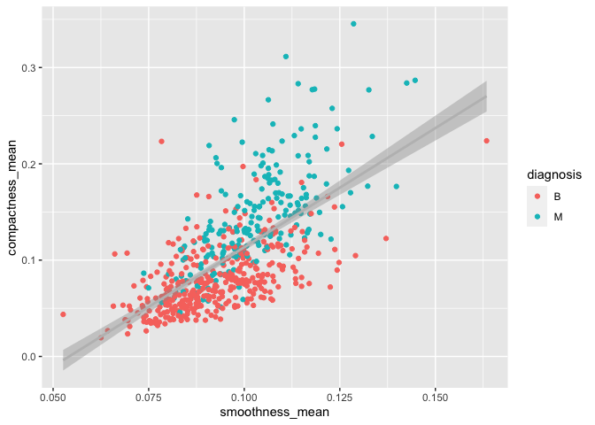
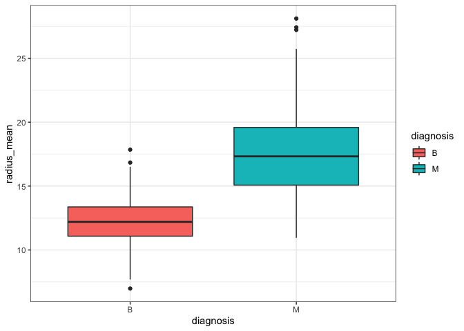
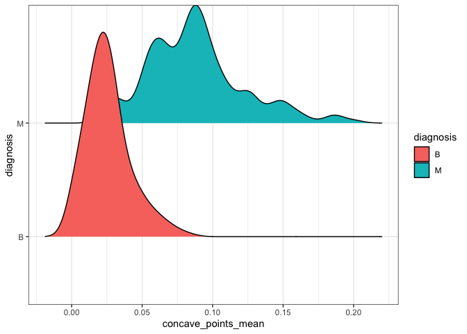
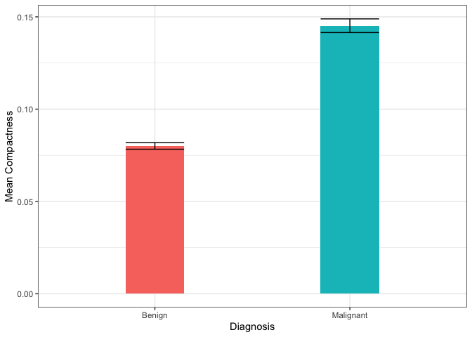
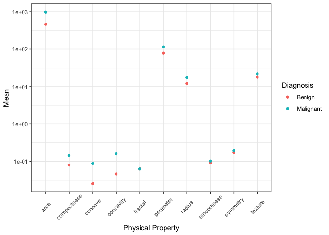
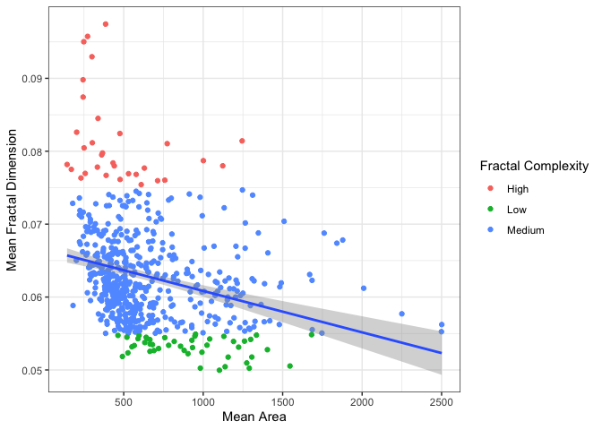
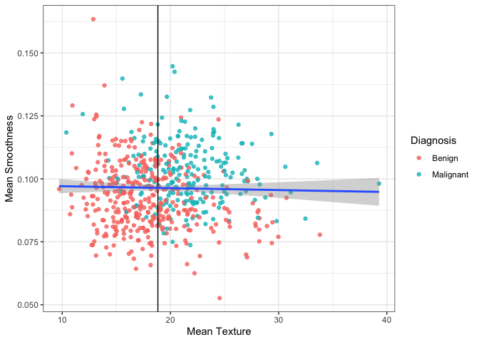

Mini Data-Analysis Deliverable 1
================

# Welcome to your (maybe) first-ever data analysis project!

And hopefully the first of many. Let’s get started:

1.  Install the [`datateachr`](https://github.com/UBC-MDS/datateachr)
    package by typing the following into your **R terminal**:

<!-- -->

    install.packages("devtools")
    devtools::install_github("UBC-MDS/datateachr")

2.  Load the packages below.

``` r
library(datateachr)
library(tidyverse)
```

    ## ── Attaching packages ─────────────────────────────────────── tidyverse 1.3.2 ──
    ## ✔ ggplot2 3.3.6      ✔ purrr   0.3.4 
    ## ✔ tibble  3.1.8      ✔ dplyr   1.0.10
    ## ✔ tidyr   1.2.0      ✔ stringr 1.4.1 
    ## ✔ readr   2.1.2      ✔ forcats 0.5.2 
    ## ── Conflicts ────────────────────────────────────────── tidyverse_conflicts() ──
    ## ✖ dplyr::filter() masks stats::filter()
    ## ✖ dplyr::lag()    masks stats::lag()

``` r
library(ggridges)
```

3.  Make a repository in the <https://github.com/stat545ubc-2022>
    Organization. You will be working with this repository for the
    entire data analysis project. You can either make it public, or make
    it private and add the TA’s and Lucy as collaborators. A link to
    help you create a private repository is available on the
    \#collaborative-project Slack channel.

# Instructions

## For Both Milestones

-   Each milestone is worth 45 points. The number of points allocated to
    each task will be annotated within each deliverable. Tasks that are
    more challenging will often be allocated more points.

-   10 points will be allocated to the reproducibility, cleanliness, and
    coherence of the overall analysis. While the two milestones will be
    submitted as independent deliverables, the analysis itself is a
    continuum - think of it as two chapters to a story. Each chapter, or
    in this case, portion of your analysis, should be easily followed
    through by someone unfamiliar with the content.
    [Here](https://swcarpentry.github.io/r-novice-inflammation/06-best-practices-R/)
    is a good resource for what constitutes “good code”. Learning good
    coding practices early in your career will save you hassle later on!

## For Milestone 1

**To complete this milestone**, edit [this very `.Rmd`
file](https://raw.githubusercontent.com/UBC-STAT/stat545.stat.ubc.ca/master/content/mini-project/mini-project-1.Rmd)
directly. Fill in the sections that are tagged with
`<!--- start your work below --->`.

**To submit this milestone**, make sure to knit this `.Rmd` file to an
`.md` file by changing the YAML output settings from
`output: html_document` to `output: github_document`. Commit and push
all of your work to the mini-analysis GitHub repository you made
earlier, and tag a release on GitHub. Then, submit a link to your tagged
release on canvas.

**Points**: This milestone is worth 45 points: 43 for your analysis, 1
point for having your Milestone 1 document knit error-free, and 1 point
for tagging your release on Github.

# Learning Objectives

By the end of this milestone, you should:

-   Become familiar with your dataset of choosing
-   Select 4 questions that you would like to answer with your data
-   Generate a reproducible and clear report using R Markdown
-   Become familiar with manipulating and summarizing your data in
    tibbles using `dplyr`, with a research question in mind.

# Task 1: Choose your favorite dataset (10 points)

The `datateachr` package by Hayley Boyce and Jordan Bourak currently
composed of 7 semi-tidy datasets for educational purposes. Here is a
brief description of each dataset:

-   *apt_buildings*: Acquired courtesy of The City of Toronto’s Open
    Data Portal. It currently has 3455 rows and 37 columns.

-   *building_permits*: Acquired courtesy of The City of Vancouver’s
    Open Data Portal. It currently has 20680 rows and 14 columns.

-   *cancer_sample*: Acquired courtesy of UCI Machine Learning
    Repository. It currently has 569 rows and 32 columns.

-   *flow_sample*: Acquired courtesy of The Government of Canada’s
    Historical Hydrometric Database. It currently has 218 rows and 7
    columns.

-   *parking_meters*: Acquired courtesy of The City of Vancouver’s Open
    Data Portal. It currently has 10032 rows and 22 columns.

-   *steam_games*: Acquired courtesy of Kaggle. It currently has 40833
    rows and 21 columns.

-   *vancouver_trees*: Acquired courtesy of The City of Vancouver’s Open
    Data Portal. It currently has 146611 rows and 20 columns.

**Things to keep in mind**

-   We hope that this project will serve as practice for carrying our
    your own *independent* data analysis. Remember to comment your code,
    be explicit about what you are doing, and write notes in this
    markdown document when you feel that context is required. As you
    advance in the project, prompts and hints to do this will be
    diminished - it’ll be up to you!

-   Before choosing a dataset, you should always keep in mind **your
    goal**, or in other ways, *what you wish to achieve with this data*.
    This mini data-analysis project focuses on *data wrangling*,
    *tidying*, and *visualization*. In short, it’s a way for you to get
    your feet wet with exploring data on your own.

And that is exactly the first thing that you will do!

1.1 Out of the 7 datasets available in the `datateachr` package, choose
**4** that appeal to you based on their description. Write your choices
below:

**Note**: We encourage you to use the ones in the `datateachr` package,
but if you have a dataset that you’d really like to use, you can include
it here. But, please check with a member of the teaching team to see
whether the dataset is of appropriate complexity. Also, include a
**brief** description of the dataset here to help the teaching team
understand your data.

<!-------------------------- Start your work below ---------------------------->

1: cancer_sample  
2: flow_sample  
3: steam_games  
4: vancouver_trees

<!----------------------------------------------------------------------------->

1.2 One way to narrowing down your selection is to *explore* the
datasets. Use your knowledge of dplyr to find out at least *3*
attributes about each of these datasets (an attribute is something such
as number of rows, variables, class type…). The goal here is to have an
idea of *what the data looks like*.

*Hint:* This is one of those times when you should think about the
cleanliness of your analysis. I added a single code chunk for you below,
but do you want to use more than one? Would you like to write more
comments outside of the code chunk?

<!-------------------------- Start your work below ---------------------------->

``` r
### EXPLORE HERE ###
# Get a glimpse of cancer_sample
cancer_sample %>% 
  glimpse() 
```

    ## Rows: 569
    ## Columns: 32
    ## $ ID                      <dbl> 842302, 842517, 84300903, 84348301, 84358402, …
    ## $ diagnosis               <chr> "M", "M", "M", "M", "M", "M", "M", "M", "M", "…
    ## $ radius_mean             <dbl> 17.990, 20.570, 19.690, 11.420, 20.290, 12.450…
    ## $ texture_mean            <dbl> 10.38, 17.77, 21.25, 20.38, 14.34, 15.70, 19.9…
    ## $ perimeter_mean          <dbl> 122.80, 132.90, 130.00, 77.58, 135.10, 82.57, …
    ## $ area_mean               <dbl> 1001.0, 1326.0, 1203.0, 386.1, 1297.0, 477.1, …
    ## $ smoothness_mean         <dbl> 0.11840, 0.08474, 0.10960, 0.14250, 0.10030, 0…
    ## $ compactness_mean        <dbl> 0.27760, 0.07864, 0.15990, 0.28390, 0.13280, 0…
    ## $ concavity_mean          <dbl> 0.30010, 0.08690, 0.19740, 0.24140, 0.19800, 0…
    ## $ concave_points_mean     <dbl> 0.14710, 0.07017, 0.12790, 0.10520, 0.10430, 0…
    ## $ symmetry_mean           <dbl> 0.2419, 0.1812, 0.2069, 0.2597, 0.1809, 0.2087…
    ## $ fractal_dimension_mean  <dbl> 0.07871, 0.05667, 0.05999, 0.09744, 0.05883, 0…
    ## $ radius_se               <dbl> 1.0950, 0.5435, 0.7456, 0.4956, 0.7572, 0.3345…
    ## $ texture_se              <dbl> 0.9053, 0.7339, 0.7869, 1.1560, 0.7813, 0.8902…
    ## $ perimeter_se            <dbl> 8.589, 3.398, 4.585, 3.445, 5.438, 2.217, 3.18…
    ## $ area_se                 <dbl> 153.40, 74.08, 94.03, 27.23, 94.44, 27.19, 53.…
    ## $ smoothness_se           <dbl> 0.006399, 0.005225, 0.006150, 0.009110, 0.0114…
    ## $ compactness_se          <dbl> 0.049040, 0.013080, 0.040060, 0.074580, 0.0246…
    ## $ concavity_se            <dbl> 0.05373, 0.01860, 0.03832, 0.05661, 0.05688, 0…
    ## $ concave_points_se       <dbl> 0.015870, 0.013400, 0.020580, 0.018670, 0.0188…
    ## $ symmetry_se             <dbl> 0.03003, 0.01389, 0.02250, 0.05963, 0.01756, 0…
    ## $ fractal_dimension_se    <dbl> 0.006193, 0.003532, 0.004571, 0.009208, 0.0051…
    ## $ radius_worst            <dbl> 25.38, 24.99, 23.57, 14.91, 22.54, 15.47, 22.8…
    ## $ texture_worst           <dbl> 17.33, 23.41, 25.53, 26.50, 16.67, 23.75, 27.6…
    ## $ perimeter_worst         <dbl> 184.60, 158.80, 152.50, 98.87, 152.20, 103.40,…
    ## $ area_worst              <dbl> 2019.0, 1956.0, 1709.0, 567.7, 1575.0, 741.6, …
    ## $ smoothness_worst        <dbl> 0.1622, 0.1238, 0.1444, 0.2098, 0.1374, 0.1791…
    ## $ compactness_worst       <dbl> 0.6656, 0.1866, 0.4245, 0.8663, 0.2050, 0.5249…
    ## $ concavity_worst         <dbl> 0.71190, 0.24160, 0.45040, 0.68690, 0.40000, 0…
    ## $ concave_points_worst    <dbl> 0.26540, 0.18600, 0.24300, 0.25750, 0.16250, 0…
    ## $ symmetry_worst          <dbl> 0.4601, 0.2750, 0.3613, 0.6638, 0.2364, 0.3985…
    ## $ fractal_dimension_worst <dbl> 0.11890, 0.08902, 0.08758, 0.17300, 0.07678, 0…

``` r
# Get a glimpse of flow_sample
flow_sample %>%
  glimpse()
```

    ## Rows: 218
    ## Columns: 7
    ## $ station_id   <chr> "05BB001", "05BB001", "05BB001", "05BB001", "05BB001", "0…
    ## $ year         <dbl> 1909, 1910, 1911, 1912, 1913, 1914, 1915, 1916, 1917, 191…
    ## $ extreme_type <chr> "maximum", "maximum", "maximum", "maximum", "maximum", "m…
    ## $ month        <dbl> 7, 6, 6, 8, 6, 6, 6, 6, 6, 6, 6, 7, 6, 6, 6, 7, 5, 7, 6, …
    ## $ day          <dbl> 7, 12, 14, 25, 11, 18, 27, 20, 17, 15, 22, 3, 9, 5, 14, 5…
    ## $ flow         <dbl> 314, 230, 264, 174, 232, 214, 236, 309, 174, 345, 185, 24…
    ## $ sym          <chr> NA, NA, NA, NA, NA, NA, NA, NA, NA, NA, NA, NA, NA, NA, N…

``` r
# Get a glimpse of steam_games
steam_games %>%
  glimpse()
```

    ## Rows: 40,833
    ## Columns: 21
    ## $ id                       <dbl> 1, 2, 3, 4, 5, 6, 7, 8, 9, 10, 11, 12, 13, 14…
    ## $ url                      <chr> "https://store.steampowered.com/app/379720/DO…
    ## $ types                    <chr> "app", "app", "app", "app", "app", "bundle", …
    ## $ name                     <chr> "DOOM", "PLAYERUNKNOWN'S BATTLEGROUNDS", "BAT…
    ## $ desc_snippet             <chr> "Now includes all three premium DLC packs (Un…
    ## $ recent_reviews           <chr> "Very Positive,(554),- 89% of the 554 user re…
    ## $ all_reviews              <chr> "Very Positive,(42,550),- 92% of the 42,550 u…
    ## $ release_date             <chr> "May 12, 2016", "Dec 21, 2017", "Apr 24, 2018…
    ## $ developer                <chr> "id Software", "PUBG Corporation", "Harebrain…
    ## $ publisher                <chr> "Bethesda Softworks,Bethesda Softworks", "PUB…
    ## $ popular_tags             <chr> "FPS,Gore,Action,Demons,Shooter,First-Person,…
    ## $ game_details             <chr> "Single-player,Multi-player,Co-op,Steam Achie…
    ## $ languages                <chr> "English,French,Italian,German,Spanish - Spai…
    ## $ achievements             <dbl> 54, 37, 128, NA, NA, NA, 51, 55, 34, 43, 72, …
    ## $ genre                    <chr> "Action", "Action,Adventure,Massively Multipl…
    ## $ game_description         <chr> "About This Game Developed by id software, th…
    ## $ mature_content           <chr> NA, "Mature Content Description  The develope…
    ## $ minimum_requirements     <chr> "Minimum:,OS:,Windows 7/8.1/10 (64-bit versio…
    ## $ recommended_requirements <chr> "Recommended:,OS:,Windows 7/8.1/10 (64-bit ve…
    ## $ original_price           <dbl> 19.99, 29.99, 39.99, 44.99, 0.00, NA, 59.99, …
    ## $ discount_price           <dbl> 14.99, NA, NA, NA, NA, 35.18, 70.42, 17.58, N…

``` r
# Get a glimpse of vancouver_trees
vancouver_trees %>%
  glimpse()
```

    ## Rows: 146,611
    ## Columns: 20
    ## $ tree_id            <dbl> 149556, 149563, 149579, 149590, 149604, 149616, 149…
    ## $ civic_number       <dbl> 494, 450, 4994, 858, 5032, 585, 4909, 4925, 4969, 7…
    ## $ std_street         <chr> "W 58TH AV", "W 58TH AV", "WINDSOR ST", "E 39TH AV"…
    ## $ genus_name         <chr> "ULMUS", "ZELKOVA", "STYRAX", "FRAXINUS", "ACER", "…
    ## $ species_name       <chr> "AMERICANA", "SERRATA", "JAPONICA", "AMERICANA", "C…
    ## $ cultivar_name      <chr> "BRANDON", NA, NA, "AUTUMN APPLAUSE", NA, "CHANTICL…
    ## $ common_name        <chr> "BRANDON ELM", "JAPANESE ZELKOVA", "JAPANESE SNOWBE…
    ## $ assigned           <chr> "N", "N", "N", "Y", "N", "N", "N", "N", "N", "N", "…
    ## $ root_barrier       <chr> "N", "N", "N", "N", "N", "N", "N", "N", "N", "N", "…
    ## $ plant_area         <chr> "N", "N", "4", "4", "4", "B", "6", "6", "3", "3", "…
    ## $ on_street_block    <dbl> 400, 400, 4900, 800, 5000, 500, 4900, 4900, 4900, 7…
    ## $ on_street          <chr> "W 58TH AV", "W 58TH AV", "WINDSOR ST", "E 39TH AV"…
    ## $ neighbourhood_name <chr> "MARPOLE", "MARPOLE", "KENSINGTON-CEDAR COTTAGE", "…
    ## $ street_side_name   <chr> "EVEN", "EVEN", "EVEN", "EVEN", "EVEN", "ODD", "ODD…
    ## $ height_range_id    <dbl> 2, 4, 3, 4, 2, 2, 3, 3, 2, 2, 2, 5, 3, 2, 2, 2, 2, …
    ## $ diameter           <dbl> 10.00, 10.00, 4.00, 18.00, 9.00, 5.00, 15.00, 14.00…
    ## $ curb               <chr> "N", "N", "Y", "Y", "Y", "Y", "Y", "Y", "Y", "Y", "…
    ## $ date_planted       <date> 1999-01-13, 1996-05-31, 1993-11-22, 1996-04-29, 19…
    ## $ longitude          <dbl> -123.1161, -123.1147, -123.0846, -123.0870, -123.08…
    ## $ latitude           <dbl> 49.21776, 49.21776, 49.23938, 49.23469, 49.23894, 4…

<!----------------------------------------------------------------------------->

1.3 Now that you’ve explored the 4 datasets that you were initially most
interested in, let’s narrow it down to 2. What lead you to choose these
2? Briefly explain your choices below, and feel free to include any code
in your explanation.

<!-------------------------- Start your work below ---------------------------->

**cancer_sample**  
- As a biologist, exploring the cancer dataset could be interesting to
potentially identify some sort of correlation between the physical
attributes of a tumour and its diagnosis as malignant or benign. I also
think this dataset is interesting since I’ve never personally thought
about physical tumour characteristics and how they affect diagnosis.

**vancouver_trees**  
- This dataset stands out to me as I would be curious to understand why
or how the data in this table relate to each other, since from first
glance each column seems unrelated to me. Additionally, I was always
curious as to why the trees at UBC have individual numbers associated
with them so this could provide some clarity.

<!----------------------------------------------------------------------------->

1.4 Time for the final decision! Going back to the beginning, it’s
important to have an *end goal* in mind. For example, if I had chosen
the `titanic` dataset for my project, I might’ve wanted to explore the
relationship between survival and other variables. Try to think of 1
research question that you would want to answer with each dataset. Note
them down below, and make your final choice based on what seems more
interesting to you!

<!-------------------------- Start your work below ---------------------------->

**cancer_sample**  
How do certain physical characteristics of tumours affect diagnosis and
each other?

**vancouver_trees**  
How do tree height and diameter vary with respect to the presence of a
root barrier?

I think that my research question concerning **cancer_sample** is more
interesting and I will choose this dataset for the mini data analysis.

<!----------------------------------------------------------------------------->

# Important note

Read Tasks 2 and 3 *fully* before starting to complete either of them.
Probably also a good point to grab a coffee to get ready for the fun
part!

This project is semi-guided, but meant to be *independent*. For this
reason, you will complete tasks 2 and 3 below (under the **START HERE**
mark) as if you were writing your own exploratory data analysis report,
and this guidance never existed! Feel free to add a brief introduction
section to your project, format the document with markdown syntax as you
deem appropriate, and structure the analysis as you deem appropriate.
Remember, marks will be awarded for completion of the 4 tasks, but 10
points of the whole project are allocated to a reproducible and clean
analysis. If you feel lost, you can find a sample data analysis
[here](https://www.kaggle.com/headsortails/tidy-titarnic) to have a
better idea. However, bear in mind that it is **just an example** and
you will not be required to have that level of complexity in your
project.

# Task 2: Exploring your dataset (15 points)

If we rewind and go back to the learning objectives, you’ll see that by
the end of this deliverable, you should have formulated *4* research
questions about your data that you may want to answer during your
project. However, it may be handy to do some more exploration on your
dataset of choice before creating these questions - by looking at the
data, you may get more ideas. **Before you start this task, read all
instructions carefully until you reach START HERE under Task 3**.

2.1 Complete *4 out of the following 8 exercises* to dive deeper into
your data. All datasets are different and therefore, not all of these
tasks may make sense for your data - which is why you should only answer
*4*. Use *dplyr* and *ggplot*.

1.  Plot the distribution of a numeric variable.
2.  Create a new variable based on other variables in your data (only if
    it makes sense)
3.  Investigate how many missing values there are per variable. Can you
    find a way to plot this?
4.  Explore the relationship between 2 variables in a plot.
5.  Filter observations in your data according to your own criteria.
    Think of what you’d like to explore - again, if this was the
    `titanic` dataset, I may want to narrow my search down to passengers
    born in a particular year…
6.  Use a boxplot to look at the frequency of different observations
    within a single variable. You can do this for more than one variable
    if you wish!
7.  Make a new tibble with a subset of your data, with variables and
    observations that you are interested in exploring.
8.  Use a density plot to explore any of your variables (that are
    suitable for this type of plot).

2.2 For each of the 4 exercises that you complete, provide a *brief
explanation* of why you chose that exercise in relation to your data (in
other words, why does it make sense to do that?), and sufficient
comments for a reader to understand your reasoning and code.

<!-------------------------- Start your work below ---------------------------->

### Further explore the cancer_sample dataset to formulate research questions

``` r
# First, assign the cancer_sample dataset to a variable "cancer"
cancer <- cancer_sample
```

#### 4. Explore if there is a relationship between smoothness and compactness of a tumour

``` r
# Explore if there is a relationship between smoothness and compactness of a tumour using a scatterplot
cancer %>% 
  ggplot(aes(x = smoothness_mean, y = compactness_mean)) +
  geom_point(aes(colour = diagnosis)) + # scatterplot geom and colour by diagnoses
  geom_smooth(method = lm, colour = "grey") # add a trendline to the plot
```

    ## `geom_smooth()` using formula 'y ~ x'

<!-- -->

#### 6.

``` r
# Plot a boxplot to see what the mean radius is for malignant vs benign tumours
# use diagnosis on the x axis as categorical variables and the mean radius_mean on the y axis
cancer %>% 
  ggplot(aes(x = diagnosis, y = radius_mean, fill = diagnosis)) + 
  geom_boxplot() + # plot a boxplot 
  theme_bw() # change to background white
```

<!-- -->

#### 8. Explore how the concave_points_mean is related to the diagnosis outcome of a tumour

``` r
# Explore how the density of diagnosis outcomes (malignant or benign) is distributed with respect to concave_points_mean 
cancer %>% 
  ggplot(aes(x = concave_points_mean, y = diagnosis, fill = diagnosis)) +
  geom_density_ridges() +
  theme_bw() # change the theme to background white
```

    ## Picking joint bandwidth of 0.00625

<!-- -->

#### 7. Creat a new tibble containing a subset of columns from cancer_sample

``` r
# Create a new tibble that is a subset of cancer_sample containing only "ID", and columns starting with radius, smoothness, compactness, and concavity_points columns. 
sub_cancer <- cancer %>% 
  select(ID, starts_with(c("radius", "smoothness", "compactness", "concavity_points"))) # select the ID columns plus any columns that start with the specified strings

glimpse(sub_cancer)
```

    ## Rows: 569
    ## Columns: 10
    ## $ ID                <dbl> 842302, 842517, 84300903, 84348301, 84358402, 843786…
    ## $ radius_mean       <dbl> 17.990, 20.570, 19.690, 11.420, 20.290, 12.450, 18.2…
    ## $ radius_se         <dbl> 1.0950, 0.5435, 0.7456, 0.4956, 0.7572, 0.3345, 0.44…
    ## $ radius_worst      <dbl> 25.38, 24.99, 23.57, 14.91, 22.54, 15.47, 22.88, 17.…
    ## $ smoothness_mean   <dbl> 0.11840, 0.08474, 0.10960, 0.14250, 0.10030, 0.12780…
    ## $ smoothness_se     <dbl> 0.006399, 0.005225, 0.006150, 0.009110, 0.011490, 0.…
    ## $ smoothness_worst  <dbl> 0.1622, 0.1238, 0.1444, 0.2098, 0.1374, 0.1791, 0.14…
    ## $ compactness_mean  <dbl> 0.27760, 0.07864, 0.15990, 0.28390, 0.13280, 0.17000…
    ## $ compactness_se    <dbl> 0.049040, 0.013080, 0.040060, 0.074580, 0.024610, 0.…
    ## $ compactness_worst <dbl> 0.6656, 0.1866, 0.4245, 0.8663, 0.2050, 0.5249, 0.25…

<!----------------------------------------------------------------------------->

# Task 3: Write your research questions (5 points)

So far, you have chosen a dataset and gotten familiar with it through
exploring the data. Now it’s time to figure out 4 research questions
that you would like to answer with your data! Write the 4 questions and
any additional comments at the end of this deliverable. These questions
are not necessarily set in stone - TAs will review them and give you
feedback; therefore, you may choose to pursue them as they are for the
rest of the project, or make modifications!

<!--- *****START HERE***** --->

**Research Questions**

1.  Can tumour compactness be used as a reliable diagnostic marker for
    tumour malignancy? If so, are there any other physical properties
    that share a positive correlation with tumour compactness and
    therefore malignancy?
2.  How are physical properties of tumours related to its malignancy.
    Create a model that accurately describes the relationships of
    physical tumour properties to the likelihood of a malignant
    diagnosis.
3.  How do physical parameters such as smoothness, concave points, area,
    etc. affect the fractal dimension of a tumour?
4.  Is there a relationship between tumour smoothness and texture?

<!---------------------------->

    # Task 4: Process and summarize your data (13 points)

From Task 2, you should have an idea of the basic structure of your
dataset (e.g. number of rows and columns, class types, etc.). Here, we
will start investigating your data more in-depth using various data
manipulation functions.

### 1.1 (10 points)

Now, for each of your four research questions, choose one task from
options 1-4 (summarizing), and one other task from 4-8 (graphing). You
should have 2 tasks done for each research question (8 total). Make sure
it makes sense to do them! (e.g. don’t use a numerical variables for a
task that needs a categorical variable.). Comment on why each task helps
(or doesn’t!) answer the corresponding research question.

Ensure that the output of each operation is printed!

**Summarizing:**

1.  Compute the *range*, *mean*, and *two other summary statistics* of
    **one numerical variable** across the groups of **one categorical
    variable** from your data.
2.  Compute the number of observations for at least one of your
    categorical variables. Do not use the function `table()`!
3.  Create a categorical variable with 3 or more groups from an existing
    numerical variable. You can use this new variable in the other
    tasks! *An example: age in years into “child, teen, adult, senior”.*
4.  Based on two categorical variables, calculate two summary statistics
    of your choosing.

**Graphing:**

5.  Create a graph out of summarized variables that has at least two
    geom layers.
6.  Create a graph of your choosing, make one of the axes logarithmic,
    and format the axes labels so that they are “pretty” or easier to
    read.
7.  Make a graph where it makes sense to customize the alpha
    transparency.
8.  Create 3 histograms out of summarized variables, with each histogram
    having different sized bins. Pick the “best” one and explain why it
    is the best.

Make sure it’s clear what research question you are doing each operation
for!

<!------------------------- Start your work below ----------------------------->

### 1. Can tumour compactness be used as a reliable diagnostic marker for tumour malignancy? If so, are there any other physical properties that share a positive correlation with tumour compactness and therefore malignancy?

To explore whether tumour compactness can be used as a reliable
diagnostic marker for tumour malignancy, let’s try and determine if
there is any statistically significant differences in the means of
tumour compactness between diagnosis groups.

First, let’s calculate some summary statistics. Here, we will calculate
the mean (and standard error of the mean), median, standard deviation,
and range, just for the sake of completeness.

``` r
sum_compactness <- cancer %>% 
  select(ID, diagnosis, compactness_mean) %>% # select for relevant columns
  group_by(diagnosis) %>% 
  summarize(across(compactness_mean, list(mean = mean_se, median = median, sd = sd, max = max, min = min), .names = "{.fn}")) %>%
  mutate(diagnosis_full = case_when(
    diagnosis == "M" ~ "Malignant", 
    diagnosis == "B" ~ "Benign")) # create a new column that renames "M" or "B" as "Malignant" or "Benign".
```

Now that we have our summary statistics, let’s plot a bar graph to see
if there is difference of means between diagnosis. We will plot the mean
for each group and add an error bar showing the standard error of the
mean as well.

``` r
sum_compactness %>% 
  ggplot(aes(x = diagnosis_full, y = mean$y, fill = diagnosis_full)) +
  geom_col(width = 0.3) + #geom1
  geom_errorbar(aes(ymin = mean$ymin, ymax = mean$ymax), width = 0.3) + # add error bars, geom2
  theme_bw() +
  labs(y = "Mean Compactness", x = "Diagnosis") + # relabel our axes
  theme(legend.position = "none") # hide the legend
```

<!-- -->

From our plot, it looks like there is a difference between the means of
malignant and benign tumour compactness. The standard error is also
pretty small so it looks like this difference *could* be significant!
We’ll have to perform a t-test down the line to confirm.

### 2. How are physical properties of tumours related to its malignancy. Create a model that accurately describes the relationships of physical tumour properties to the likelihood of a malignant diagnosis.

Before trying to create a “model”, let’s first see if there are any
noticeable differences between the means of the physical properties in
each diagnosis, either malignant or benign.

First, we will calculate the mean, range, median, and standard deviation
of all physical properties, grouped by diagnosis and store it in a new
dataframe called `sum_cancer`.

``` r
# Here, instead of using the range() function, we will use the max() and min() functions individually to calculate the range. This is nice here since using the range() function within summarize() creates two rows, one for max and one for min, which is actually redundant for our purposes. Using the functions individually will create two columns, one for max and one for min, which is more tidy.
sum_cancer <- cancer %>% 
  select(ID, diagnosis, ends_with("mean")) %>% 
  group_by(diagnosis) %>% 
  summarize(across(ends_with("mean"), list(Mean = mean, Min = min, Max = max, Median = median, SD = sd)))
```

Now that we have a dataframe containing a bunch of summary stats for
each diagnosis, let’s plot the means of each physical characteristic
grouped by diagnosis. This can help us see if there is a noticeable
difference between the malignant or benign groups for each physical
property.

To do this, we should pivot our data longer as this will make it a lot
easy to plot using ggplot. Let’s pivot all the names of the means of
physical properties into a column called `Physical_Property` and all of
the values into a column called `Mean`.

``` r
psum_cancer <- sum_cancer %>% 
  select(diagnosis, ends_with("Mean")) %>% 
  pivot_longer(cols = ends_with("Mean"), names_to = "Physical_Property", values_to = "Mean") %>% 
  separate(Physical_Property, into = c("Physical_Property"), sep = "_", remove = TRUE) # this line of code is a workaround that removes the suffixes to our colnames. It will make our plot look a tad bit cleaner.
```

    ## Warning: Expected 1 pieces. Additional pieces discarded in 20 rows [1, 2, 3, 4,
    ## 5, 6, 7, 8, 9, 10, 11, 12, 13, 14, 15, 16, 17, 18, 19, 20].

Now let’s plot our data. There are a variety of geoms we could
potentially use, but let’s stick with geom_point() here. You might also
notice that a lot of the points are really close together for some
physical properties so we can use a log10 transformation to make the
graph more readable.

``` r
psum_cancer %>% 
  ggplot(aes(x = Physical_Property, y = Mean, colour = diagnosis)) +
  geom_point() +
  scale_y_continuous(trans = "log10") + # make y-axis log10 transformed
  theme_bw() +
  theme(axis.text.x = element_text(angle = 45, vjust = 0.6, hjust = 0.5)) +
  labs(x = "Physical Property", colour = "Diagnosis") + # relabel the axes and legend title 
  scale_colour_discrete(labels = c("Benign", "Malignant")) # relabel our legend text to their full names
```

<!-- -->

It looks like the means of a lot of physical properties have a
noticeable difference between diagnoses. Notably, area, compactness,
concave points, and concavity look to have the greatest differences.
Fractal dimension seems to have no difference in mean and smoothness and
symmetry also seem to have minimal difference. Next, we should do some
stats analysis to see if these differences are *actually* statistically
significant!

### 3. How do physical parameters such as smoothness, concave points, area, etc. affect the fractal dimension of a tumour?

To start off, let’s try and determine if there is a relationship between
area and fractal dimension. Fractal dimension is (at least to my
knowledge) a measure of how complex something is. So we will ask
ourselves if having a greater area increases, decreases, or has no
effect on tumour complexity.

Let’s make some new categorical variables for our fractal dimensions.
Before doing this, let’s see what the max, min, and mean of
`fractal_dimension_mean` is so we can make an informed decision on how
to categorize `fractal dimensions`.

``` r
# Make a new summary dataset containing mean, min, and max. 
cancer %>% 
  summarize(Mean = mean(fractal_dimension_mean), Min = min(fractal_dimension_mean), Max = max(fractal_dimension_mean))
```

    ## # A tibble: 1 × 3
    ##     Mean    Min    Max
    ##    <dbl>  <dbl>  <dbl>
    ## 1 0.0628 0.0500 0.0974

From this it looks like: `mean = 0.0628`, `min = 0.04996`,
`max = 0.09744`. Based on this, let’s arbitrarily say that a fractal
dimension of \<= 0.055 is “low”, between 0.055 and 0.075 is “medium”,
and greater than 0.075 is “high”.

``` r
# We can use mutate and the case_when() function to categorize `fractal_dimension_mean` based on conditions. 
sum_cancer_fractal <- cancer %>% 
  mutate("fractal_complexity" = 
           case_when(
             fractal_dimension_mean <= 0.055 ~ "low", 
             fractal_dimension_mean > 0.055 & fractal_dimension_mean <= 0.075 ~ "medium", 
             fractal_dimension_mean > 0.075 ~ "high"
           )) %>% 
  select(ID, diagnosis, starts_with(c("area", "fractal"))) # here we will only select data that's pertinent to us right now.
```

Now that we have categorized fractal dimensions, let’s make a
scatterplot of fractal dimension against area and see if we can fit some
sort of model to it. We will also colour fractal dimension by our newly
made categorical variables to help read our data.

``` r
sum_cancer_fractal %>% 
  ggplot(aes(x = area_mean, y = fractal_dimension_mean)) +
  geom_point(aes(colour = fractal_complexity)) +
  geom_smooth(method = "lm") +
  theme_bw() +
  labs(y = "Mean Fractal Dimension", x = "Mean Area", colour = "Fractal Complexity") + # rename axes and legend titles
  scale_color_discrete(labels = c("High", "Low", "Medium")) # relabel legend text
```

    ## `geom_smooth()` using formula 'y ~ x'

<!-- -->

It looks like there is a slight negative correlation of fractal
dimension to area! This is cool and could be worth exploring more! We
could also explore how other physical properties relate to fractal
dimension too in a similar way.

### 4. Is there a relationship between tumour smoothness and texture?

Let’s try and figure out if there is a relationship between tumour
smoothness and texture. Smoothness inherently seems like it would affect
texture (right?) so this could be interesting!

To do this, let’s make a scatterplot of smoothness against texture. We
will calculate the means and medians of texture and plot it as a
vertical line on our graph so we can also see if diagnosis as malignant
or benign is more distributed to either side of the texture mean, if at
all.

``` r
# Calculate mean, range, median, standard deviation of texture. This dataframe will be used to make our vertical line representing texture median
sum_texture <- cancer %>% 
  select(starts_with(c("texture", "smoothness"))) %>% 
  summarize(Mean_texture = mean(texture_mean), Median_texture = median(texture_mean))
```

Now we can plot a scatterplot exploring smoothness vs texture. We will
use geom_vline() to make our vertical line representing texture median.
Additionally, we can also try to fit a model to our data.

``` r
cancer  %>% 
  ggplot(aes(x = texture_mean)) +
  geom_point(aes(y = smoothness_mean, colour = diagnosis), alpha = 0.8) + #geom1
  geom_vline(xintercept = sum_texture$Median_texture) + #geom2
  geom_smooth(aes(y = smoothness_mean), method = "lm") + # fit a linear regression model to our data, geom3
  theme_bw() +
  labs(y = "Mean Smoothness", x = "Mean Texture", colour = "Diagnosis") + # rename axes
  scale_colour_discrete(labels = c("Benign", "Malignant")) # rename legend text to full names
```

    ## `geom_smooth()` using formula 'y ~ x'

<!-- -->

Well, it looks like there isn’t a very distinct relationship between
texture and smoothness. Maybe this is counterintuitive, but at least now
we know! Regardless, diagnosis seems to be more slightly distributed
more towards a higher texture score, so this could be interesting to
explore more!

<!----------------------------------------------------------------------------->

### 1.2 (3 points)

Based on the operations that you’ve completed, how much closer are you
to answering your research questions? Think about what aspects of your
research questions remain unclear. Can your research questions be
refined, now that you’ve investigated your data a bit more? Which
research questions are yielding interesting results?

<!-------------------------- Start your work below ---------------------------->
<!----------------------------------------------------------------------------->

### Attribution

Thanks to Icíar Fernández Boyano for mostly putting this together, and
Vincenzo Coia for launching.
